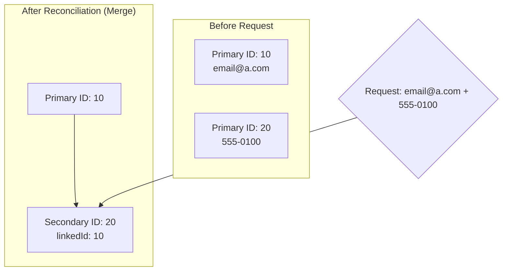

# Identity Resolution Service (IRS)

An enterprise-grade, high-performance Node.js service designed to resolve fragmented customer identities. By intelligently linking disparate data points (emails and phone numbers) across distributed interaction events, the system constructs a single, comprehensive "Golden Record" for each customer.

## 🚀 Key Value Prop

In modern e-commerce and SaaS ecosystems, customers often interact using multiple personas (work email, personal email, spouse's phone). This service reconciles those personas into a unified identity cluster, enabling:
- **Unified Customer Analytics**: Accurate Lifetime Value (LTV) calculation.
- **Improved Marketing Attribution**: Understanding the full customer journey.
- **Enhanced Customer Support**: Immediate access to a customer's full historical context.

---

## 📖 API Specification

### Consolidated Identity Endpoint
`POST /identify`

Analyzes incoming contact identifiers and returns the fully consolidated identity cluster.

#### Request Schema
```json
{
  "email": "string | null",
  "phoneNumber": "string | null"
}
```
*Requirement: At least one identifier is mandatory for processing.*

#### Response Schema (200 OK)
```json
{
  "contact": {
    "primaryContactId": 12,
    "emails": ["user1@example.com", "alias@work.com"],
    "phoneNumbers": ["123456789", "987654321"],
    "secondaryContactIds": [13, 15]
  }
}
```

#### Error Codes
| Status | Description |
|---|---|
| `400` | Bad Request: Validation failed (missing both identifiers). |
| `500` | Internal Server Error: Transactional failure or downstream dependency timeout. |

---

## 🧠 Business Logic & Deterministic Reconciliation

The engine operates on a multi-stage reconciliation algorithm:

### 1. Discovery Phase
The system queries the database for any existing records matching the provided `email` OR `phoneNumber`.

### 2. Linking Strategy
- **New Persona**: If zero matches are found, a new `Primary` record is initialized.
- **Cluster Expansion**: If the request contains a *new* identifier but matches an existing cluster, a `Secondary` record is created and linked to the cluster's `Primary` ID.
- **Passive Match**: If all provided data already exists within the same cluster, the system simply returns the existing consolidated profile without creating new records.

### 3. Conflict Resolution (The "Primary Demotion" Event)
In complex scenarios where a single request links two previously independent `Primary` clusters, the system invokes a **Conflict Resolution Policy**:
- **Winning Primary**: The chronologically oldest `Primary` record is retained.
- **Losing Primary**: The newer `Primary` is demoted to `Secondary` status.
- **Cluster Re-homing**: All contacts previously linked to the demoted primary are updated to point to the winning `Primary`, ensuring the cluster remains a "Star Schema" with exactly one root.

#### Visualization of a Merge Event:


---

## 🛠️ Technical Architecture

### Tech Stack
- **Runtime**: Node.js (TypeScript) for strong typing and developer velocity.
- **API Framework**: Express.js (v5) utilizing asynchronous middleware patterns.
- **ORM**: Prisma v7 — leverages high-performance WASM engines and native driver adapters.
- **Database**: PostgreSQL on Neon (Serverless Storage with Branching capabilities).

### Performance & Scalability Design
- **Driver Adapters**: Uses `@prisma/adapter-pg` with a `Pool` configuration to manage high-concurrency connection spikes.
- **Star-Schema Identities**: By linking all secondary records directly to a single primary ID, we avoid "deep nesting" or recursion during lookups, ensuring O(1) traversal within a cluster.
- **Database Indexing**: Targeted B-tree indexes on `email` and `phoneNumber` ensure sub-millisecond query times even as the dataset grows to millions of rows.

---

## ⚙️ Development Environment

### Prerequisites
- Node.js (LTS version)
- PostgreSQL Instance (Neon recommended for serverless scaling)

### Setup & Installation
```bash
# 1. Install dependencies
npm install

# 2. Environment Configuration
# Copy .env.example to .env and populate:
# DATABASE_URL: Pooled connection for runtime
# DIRECT_URL: Direct connection for migrations
```

### Database Operations
```bash
# Generate the type-safe client
npx prisma generate

# Apply schema migrations
npx prisma migrate dev
```

### Script Manifest
| Script | Command | Description |
|---|---|---|
| `dev` | `npm run dev` | Starts server with live-reload (ts-node-dev). |
| `build` | `npm run build` | Compiles TypeScript to optimized JavaScript in `dist/`. |
| `start` | `npm start` | Executes the production-ready build. |
| `seed` | `npx ts-node prisma/seed.ts` | Populates the DB with 18 complex identity clusters. |

---

## 📂 Project Structure

```text
├── prisma/
│   ├── schema.prisma       # Source of Truth: Data Models & Constraints
│   ├── seed.ts             # Data Population Script (Cluster Mocking)
│   └── migrations/         # Immutable Schema History
├── src/
│   ├── server.ts           # Protocol Orchestration (Port Bindings)
│   ├── app.ts              # Middleware & Route Orchestration
│   ├── controllers/        # Request Validation & Response Shaping
│   ├── routes/             # HTTP Verb Mapping
│   ├── services/           # Reconcilation Engine & Business Rules
│   └── prisma/             # Managed Client Singleton
└── prisma.config.ts        # Prisma 7 Dynamic Configuration
```
